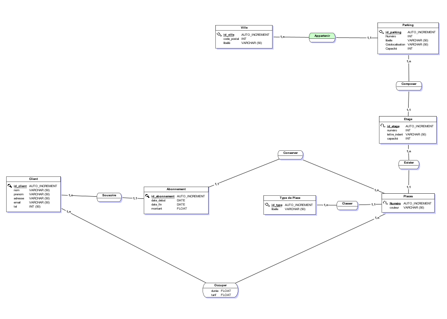
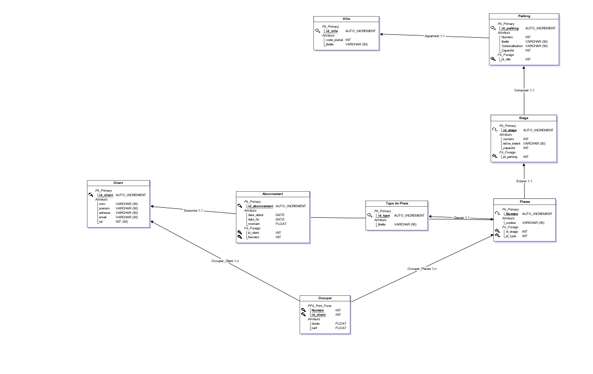

# Révisions Générales : Modelisation avec Merise et SQL

## Sujet :
la société Vinci exploite plusieurs parking dans plusieurs villes. Un parking est identifié par un numéro, un libellé, une géolocalisation et une capacité de stationnement. Une ville est identifié par son conde postal et son libellé. Chaque parking est composé d'étages ayant un numéro, une lettre d'identification et une capacité. Une place de parking existe dans un étage, elle est identifié par un numéro, une couleur, et appartient à un type de places (courantes, mobilité réduite, deux roues etc ...).  
Un client connu par un nom, prénom, addresse, email, tel peut souscrire un abonnement sur une place (date de début, date de fin, montant), il peut aussi juste occuper une place pour une durée avec un tarif.

### Modélisation :
   - Elaborer le MCD  

      
   - Ecrire le MLDR  
   

### SQL :
  - Ecrire les requêtes de création des tables
  - Insérer des données dans les tables

```sql
#------------------------------------------------------------
#        Script MySQL.
#------------------------------------------------------------


#------------------------------------------------------------
# Table: Ville
#------------------------------------------------------------

CREATE TABLE Ville(
        id_ville    Int  Auto_increment  NOT NULL ,
        code_postal Int NOT NULL ,
        libelle     Varchar (50) NOT NULL
);


#------------------------------------------------------------
# Table: Parking
#------------------------------------------------------------

CREATE TABLE Parking(
        id_parking      Int  Auto_increment  NOT NULL ,
        Numero          Int NOT NULL ,
        libelle         Varchar (50) NOT NULL ,
        Geolocalisation Varchar (50) NOT NULL ,
        Capacite        Int NOT NULL ,
        id_ville        Int NOT NULL
	      FOREIGN KEY (id_ville) REFERENCES Ville(id_ville)
);


#------------------------------------------------------------
# Table: Etage
#------------------------------------------------------------

CREATE TABLE Etage(
        id_etage      Int  Auto_increment  NOT NULL ,
        numero        Int NOT NULL ,
        lettre_indent Varchar (50) NOT NULL ,
        capacite      Int NOT NULL ,
        id_parking    Int NOT NULL,
        FOREIGN KEY (id_parking) REFERENCES Parking(id_parking)
);


#------------------------------------------------------------
# Table: Type de Place
#------------------------------------------------------------

CREATE TABLE Type_de_Place(
        id_type Int  Auto_increment  NOT NULL ,
        libelle Varchar (50) NOT NULL,
);


#------------------------------------------------------------
# Table: Places
#------------------------------------------------------------

CREATE TABLE Places(
        Numero   Int  Auto_increment  NOT NULL ,
        couleur  Varchar (50) NOT NULL ,
        id_etage Int NOT NULL ,
        id_type  Int NOT NULL,
	       FOREIGN KEY (id_etage) REFERENCES Etage(id_etage),
         FOREIGN KEY (id_type) REFERENCES Type_de_Place(id_type)
);


#------------------------------------------------------------
# Table: Client
#------------------------------------------------------------

CREATE TABLE Client(
        id_client Int  Auto_increment  NOT NULL ,
        nom       Varchar (50) NOT NULL ,
        prenom    Varchar (50) NOT NULL ,
        adresse   Varchar (50) NOT NULL ,
        email     Varchar (50) NOT NULL ,
        tel       Int NOT NULL
);


#------------------------------------------------------------
# Table: Abonnement
#------------------------------------------------------------

CREATE TABLE Abonnement(
        id_abonnement Int  Auto_increment  NOT NULL ,
        date_debut    Date NOT NULL ,
        date_fin      Date NOT NULL ,
        montant       Float NOT NULL ,
        id_client     Int NOT NULL ,
        Numero        Int NOT NULL,
        FOREIGN KEY (id_client) REFERENCES Client(id_client)
	      FOREIGN KEY (Numero) REFERENCES Places(Numero)
);


#------------------------------------------------------------
# Table: Occuper
#------------------------------------------------------------

CREATE TABLE Occuper(
        Numero    Int NOT NULL ,
        id_client Int NOT NULL ,
        duree     Float NOT NULL ,
        tarif     Float NOT NULL,
	      FOREIGN KEY (Numero) REFERENCES Places(Numero)
	      FOREIGN KEY (id_client) REFERENCES Client(id_client)
);
```
### Reqêtes :

- implémenter la base de donnée dans Mysql
- réaliser les requêtes d'insertion dans les tables, cinq enregistrements dans chaques tables
- Afficher les données de chaques table et faites des copies d'écrans
- Ecrire et faites executer les requêtes suivantes :
  - Afficher les places de parking (num, couleur, num etage, libelle du parking)
  - On augment les montants des abonnements de 2%, realiser la mise a jour
  - Afficher les montants globaux des abonnements du client dont le nom est "x" et le prenom est "y", choisir un Client
  - Quel est le nombre d'abonnements du client (nom est "x" et le premom est "y")
  - afficher le nombre de places par étages du parking ayant le libelle "x"
  - Quelle est la somme percue pour toutes les occupations de places
  - Lister les places (num, couleur) et numero etage ayant le type de place mobilité réduite
