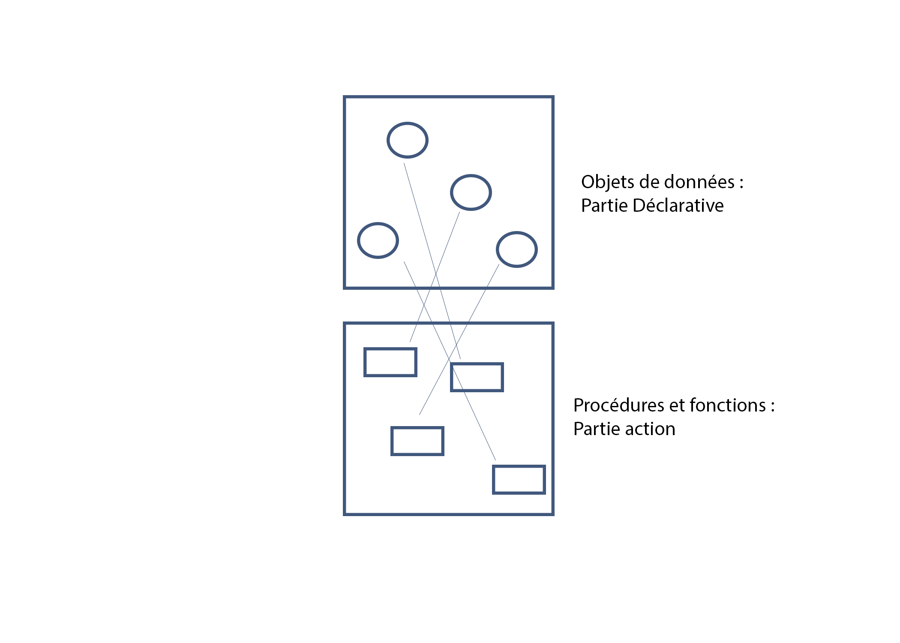
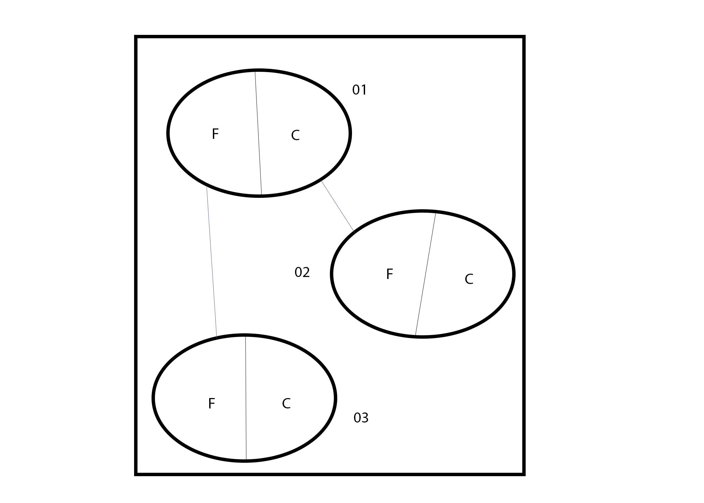
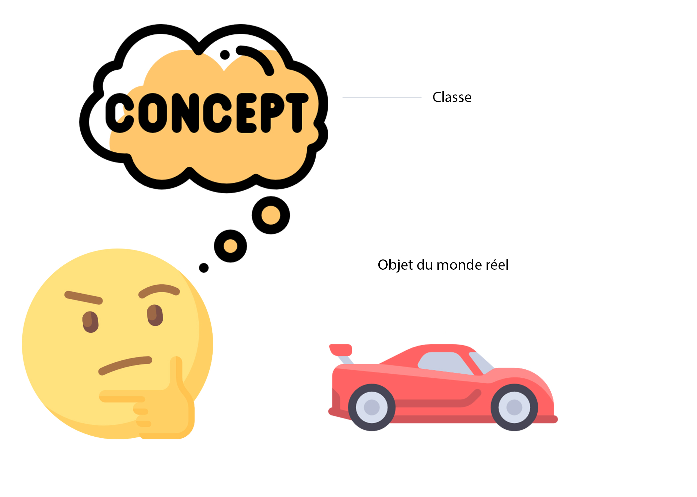

# La POO
## Introduction

Dans la programmation structurée, un programme est composé d'une partie objets de données et d'une partie actions (procédures et fonctions). Les actions agissent sur les objets de données.

#### Schéma :
  

Insuffisance de la programmation structurée :
  1. Manque de visibilité et lisibilité des codes
  2. difficulté de réutilisabilité des codes
  3. difficulté de maintenance des codes

La Poo vient palier ces problèmes en offrant une nouvelle conception de la programmation.

> La poo tente de modéliser les objets du monde réel tels qu'ils sont perçus sous forme d'un état et d'un comportement.

**Etat**: ensemble de **propriétés**, **attributs**, **caractéristiques** qui définissent l'objet intrinsequement.

**Comportement**: ensemble de **méthodes** (procédures et fonctions) qui agissent sur l'état et le font évoluer.

##### Exemple :
```
    Etat : nom, prenom, addresse, taille ...
Homme
    Comportement : naitre, grandit, voyager, ..., mourir
        Etat: numero, solde, nom, ...

Compte Banquaire
    Comportement : Ouvir, consulter, deposer, ..., fermer

```

Un programme en POO devient un ensemble d'objets qui peuvent communiquer entre eux.

#### Schéma :


## Les concepts de base de la POO :
### Les classes et les objets :

Une classe est une famille, un modèle, un super-type qui possède un nom et est composée d'un état et d'un comportement.

Un objet est une réalisation de la classe dans le monde réel, est une instance de la classe (une sorte de).

#### Schéma :


#### Syntaxe de déclaration :
Algo :

```
Algo: classe NomClasse
      // attributs
      // méthode
    fin classe
```
Java et PHP :

```php
class NomClasse {
  // attributs
  // méthodes
}
```

Principe d'instanciation: c'est la création d'un objet d'une classe. On ne dira plus : _je déclare une variable_ mais : **J'instancie une classe**.

#### Syntaxe :

Algo :
```
nomObjet : NomClasse
```

Java :
```java
NomClasse nomObjet = new NomClasse();
```
PHP :
```php
$nomObjet = new NomClasse();
```

Accès aux attributs et méthodes :  
Algo et Java : On utilise le point de composition :
```java
nomObjet.attribut
nomObjet.methode()
```
En PHP : On doit garder la syntaxe du C :
```PHP
$nomObjet -> attribut
$nomObjet -> methode()
```

### La Visibilitée

les membres de la classe (attribut ou méthode) peuvent être accessibles selon les trois types de visibilité suivants :

**privé** : **private** : tout membre déclaré en protégé est accessible dans sa classe exclusivement

**public** : tout membre déclaré en public est accessible dans sa classe est à l'exterieur de cette ci.

**protégé** : **protected** :  tout membre déclaré en protégé est accessible dans sa classe et les classes héritières (principe d'héritage)

**Principe d'encapsulation**: tous les attributs sont déclarés en privé sauf exception. Toutes les méthodes sont déclarées en public sauf exception.

> Comment accéder aux attributs privés d'une classe à partir d'une autre classe ?

On crée pour chaque attribut deux méthodes :
   - un getter : qui permer d'accéder a la valeurs d'un attribut
   - un setter : qui permet de modifier la valeurs d'un attribut

Syntaxe Java :
```java
class Date {
  private int j, m, a;

  public int getJour() {
    return j;
  }

  public void setJour(int unJour) {
    j = unJour;
  }
}
```

### La référence this
Chaque objet incorpore en son sein une référence (un pointeur) appelé this qui permet l'autoréférencement (le moi). This lève l'ambiguité de noms entre les attributs de la classe et les arguments ou variables locales des méthodes.
Le `this` indique que l'objet est courant.

#### syntaxe :
en Java et Algo :
```java
this.attribut
this.methode()
```
en PHP :
```php
$this->attribut
$this->methode()
```

##### Exemple :
```java
class Date {
  private int j, m, a; // les attributs

  public void setJour(int j) { // un argument
    // l'attribut j reçoit la valeur de l'argument
    this.j = j;
  }
}
```

### Les constructeurs et destructeurs

Les **constructeurs** sont des méthodes particulières qui s'exécutent dès l'instanciation d'une classe. Ils permettent l'initialisation des attributs de la classe. Ils peuvent recevoir des arguments mais ne retournent aucun résultat.

#### Syntaxe :
En java :
```java
// les constructeurs ont le même nom que la classe
```
En PHP > V5:
```php
__construct()
```

Les **destructeurs** sont des méthodes particulières qui s'executent dès la fin de vie d'un objet. En java, il n'y a pas de destructeur car java dispose d'un programme ramasse miettes qui récupère les espaces mémoires non utilisés.

#### Syntaxe:
en PHP:
```PHP
__destroy()
```

##### Exemple
Exemple en Java:
```java
class Date {
  private int j, m, a;

  public Date(){ // meme nom que la classe
    this.j = 0;
    this.m = 0;
    this.a = 0;
  }
}
```
Exemple en PHP :
```php
class Date {
  private $j, $m, $a;

  public function __construct()
  {
    $this->j = 0;
    $this->m = 0;
    $this->a = 0;
  }
}
```

## Les autres concepts de la POO :
### La composition des classes :
