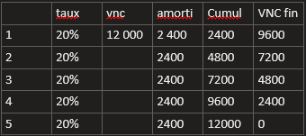
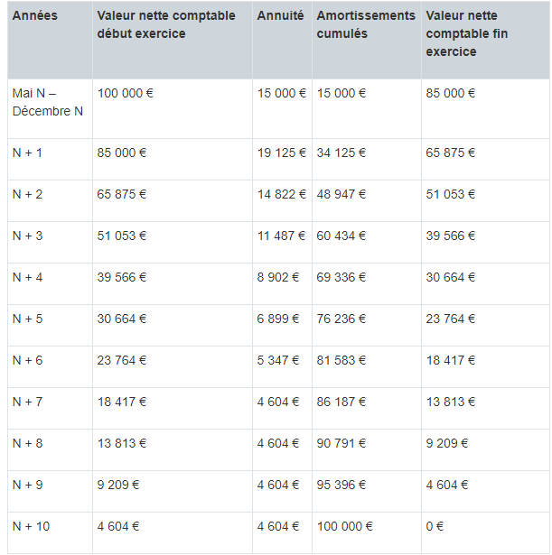

# Notions de rentabilité

## 1. les coûts (charges) :

  - Coûts fixes : ce sont les charges qui n'évoluent pas avec le chiffre d'affaire.
    - Dans les coûts fixes ont retrouve :
      - les salaires en fonction du temps
        - 35h/semaines soit 151.67h/mois
        - si on travail plus : 169h/mois  
        \--> 151.67h payé normalement + 17.33h majorées en heures supp
        - Cout réel pour l'entreprise :
          - salaire brut * 1.5
      - amortissement des investissements :
        - Sont compris comme investissements tous les achats de plus de 500euros HT
        - Deux systèmes d'amortissement :
          - l'amortissement linéaire
            - materiel neuf et d'occasion
            - taux d'amortit = 1/n --> durée de vie
            - Si n = 5ans : 1/5 = 0.2 soit 20%
            - Tableau amortissement linéaire:    
          - l'amortissement dégressif
            - Seulement sur du materiel neuf
            - le taux d'amortissement dégressif :
              - taux linéaire * coef fiscal
  ### Exemple taux dégressif :
  Une entreprise achète une machine pour 100 000 € le 5 mai de l’année N. Elle veut l’amortir en dégressif sur 10 ans.

Le coefficient dégressif correspondant est donc de 2,25, puisque la durée d'utilisation est supérieure à 6 ans. Le taux dégressif est de 22,5 % (soit 1/10 ans x 2,25).

Le premier amortissement court du 1er mai au 31 décembre, soit 8 mois :

Première annuité = 100 000 € x 22,5 % x 8 mois ÷ 12 mois = 15 000 €

Autres annuités dégressives = valeur nette comptable début exercice x 22,5 %

À partir de N + 7, il faut passer en amortissement linéaire pour les 3 dernières années

# Le seuil de rentabilité

-> Une année = 360 jours

Calcul : 
